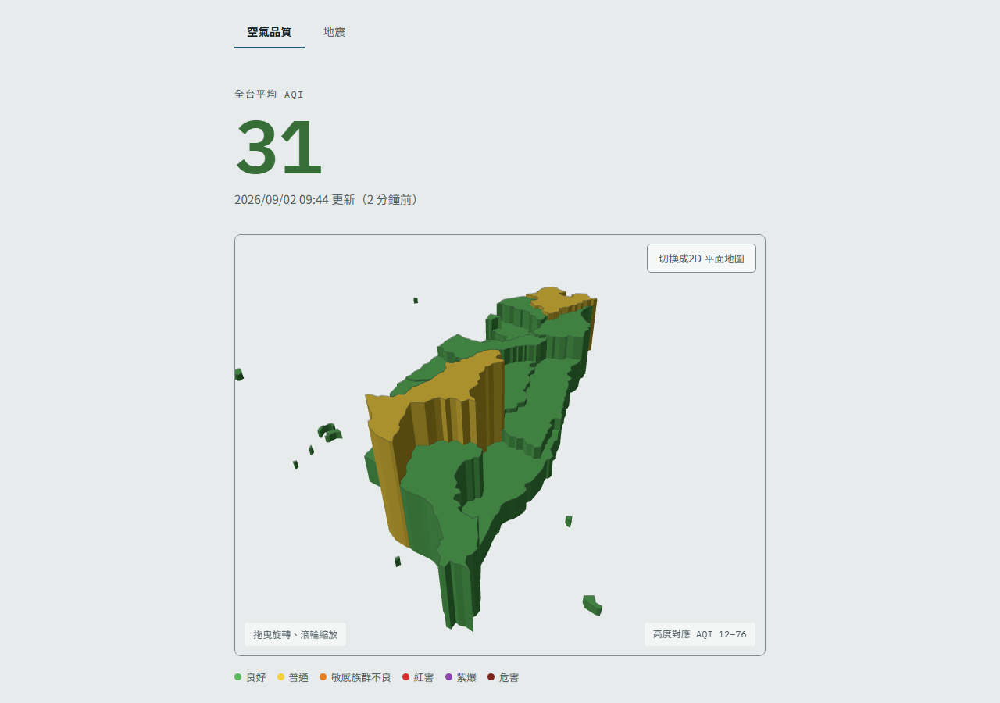

# 台灣環境監測站

全台空氣品質 AQI 與近期有感地震的公開儀表板。資料每 3 小時由 GitHub Actions
自動抓取更新，純靜態網站部署在 GitHub Pages，沒有自己的後端伺服器。

**線上版本：<https://joe94113.github.io/tw-environment-watch/>**

[](https://github.com/joe94113/tw-environment-watch/actions/workflows/deploy.yml)



## 功能

- **空氣品質**：全台平均 AQI、各縣市分級地圖、各測站即時數值表格
- **地震**：最近一次地震的規模與位置、各縣市最大震度地圖、近期地震列表
- **兩種地圖**：3D 立體擠出（縣市高度對應數值，滑過顯示名稱與數值）與 2D 平面，可切換
- **無障礙**：地圖標示為裝飾用途，所有資料一律同時提供可鍵盤操作、可排序的表格
- **SEO**：兩個頁面各自有實體 HTML 與獨立的標題／描述／canonical，內容在建置時預先渲染

## 資料來源

| 資料 | 來源 | 資料集 |
|---|---|---|
| 空氣品質 AQI | [環境部環境資料開放平臺](https://data.moenv.gov.tw) | `aqx_p_432` 空氣品質指標（即時） |
| 地震 | [中央氣象署氣象資料開放平臺](https://opendata.cwa.gov.tw) | `E-A0015-001` 顯著有感地震報告 |
| 縣市地圖 | `src/data/taiwan-counties.topo.json` | TopoJSON，MIT 授權 |

更新頻率為每 3 小時（`.github/workflows/deploy.yml` 的 cron 設定）。

### 資料策略：只往前累積，不回補歷史

一開始的計畫是連政府的歷史資料集一起回補，但那些資料集查起來太不穩定
（欄位、參數都對不太起來），所以改成**從上線那天開始，只靠排程往前累積**：

- 空氣品質依「年-月」分檔存放（`src/data/air-quality/2026-09.json`），
  避免單一檔案隨時間長到不合理的大小；舊月份檔案不會再被改動
- 地震資料量小，維持累積在單一檔案 `src/data/earthquakes.json`

## 技術

Vue 3 + Vue Router、Vite、Three.js（3D 地圖）、D3 + TopoJSON（投影與地圖資料）、Vitest。

## 本機開發

### 1. 申請兩把 API Key（免費）

- 空氣品質：<https://data.moenv.gov.tw> 註冊會員取得
- 地震：<https://opendata.cwa.gov.tw> 註冊會員取得

### 2. 建立 .env

```bash
cp .env.example .env
# 打開 .env，把兩把 key 填進去
```

`.env` 已經被 `.gitignore` 排除。**永遠不要把 key 直接寫進程式碼或貼到會被 commit 的檔案裡。**

### 3. 安裝與啟動

```bash
npm install
npm run dev
```

### 4. 手動抓一次資料

```bash
npm run fetch:air-quality
npm run fetch:earthquake
```

抓取腳本對 5xx、429、連線失敗會自動退避重試（1s → 2s → 4s）；
4xx 則立刻放棄，因為 API key 錯誤這類問題重試也沒用。

如果空品腳本顯示「回傳 0 筆」，它會**保留既有資料不覆寫**並以非零狀態結束——
這通常代表 API 回應格式跟腳本預期的不一樣（環境部／氣象署平台偶爾會調整欄位）。
要對照實際欄位，把 `scripts/fetch-air-quality.js` 或 `scripts/fetch-earthquake.js`
裡的原始回應印出來，再調整 `normalizeRecord` / `normalize` 的欄位名稱。

## 測試

```bash
npm test
```

涵蓋 AQI 與震度分級、測站彙整成縣市、時間格式化、抓取重試邏輯。

## 建置與部署

### 建置是三個步驟

```bash
npm run build
```

實際會依序跑：

1. `vite build` — 一般的前端打包
2. `vite build --ssr` — 產生 Node 端可執行的版本
3. `node scripts/prerender.js` — 把每條路由各渲染成一份實體 HTML

第三步是必要的，不是最佳化。GitHub Pages 是純靜態 host，history mode 的
`/earthquake` 沒有對應檔案就只能靠 404.html 轉址，而那條路徑回的是 **HTTP 404**，
對 SEO 有害。預先產生 `dist/earthquake/index.html` 之後，Pages 就會用 200 直接回應。
順帶讓爬蟲與首屏拿到的是有內容的 HTML，而不是一個空 div。

只要純前端打包（不含預渲染）可以用 `npm run build:client`。

### GitHub Pages 設定

repo 的 **Settings → Pages → Build and deployment → Source** 選 **GitHub Actions**。
（沒設定的話 `actions/deploy-pages` 會失敗並回 404。）

部署用的 secrets 在 **Settings → Secrets and variables → Actions**：

| Name | Value |
|---|---|
| `MOENV_API_KEY` | 環境部 API Key |
| `CWA_API_KEY` | 氣象署 API Key |

### 自動化

`.github/workflows/deploy.yml` 每 3 小時（以及 push 到 `main` 時）會：
抓資料 → commit 回 repo → 跑測試 → 建置 → 部署。

上游 API 掛掉**不會**擋住部署：兩個抓取步驟設了 `continue-on-error`，
網站會帶著既有資料照常重建上線，失敗則以 workflow annotation 呈現。

## 專案結構

```
scripts/
  fetch-air-quality.js        抓最新 AQI，寫入分月檔案
  fetch-earthquake.js         抓最新地震，累積進單一檔案
  prerender.js                建置第三步：每條路由產生實體 HTML
  og-card.html                分享預覽圖的來源（產生指令寫在檔案頂端）
  lib/
    fetch-retry.js            會退避重試的 fetch（含測試）
    json-store.js             讀寫 JSON 資料檔
    county-names.js           縣市名稱 → 地圖代碼（地震腳本用）
src/
  main.js                     瀏覽器端進入點
  entry-server.js             預渲染用的進入點
  router/index.js             路由與各頁標題／描述
  views/
    AirQuality.vue            空氣品質頁
    Earthquake.vue            地震頁
  components/
    TaiwanMap.vue             2D 平面地圖（SVG）
    TaiwanMap3D.vue           3D 立體地圖（Three.js）
    MapView.vue               2D/3D 切換
    StatHero.vue              大數字開場
    DataTable.vue             可排序、無障礙的資料表格
  utils/
    aqi.js                    AQI 分級
    earthquake.js             震度分級
    aggregate-aqi.js          測站彙整成縣市層級
    datetime.js               時間格式化（固定台灣時區）
  data/
    taiwan-counties.topo.json 縣市地圖
    air-quality-latest.json   最新 AQI 快照
    air-quality/YYYY-MM.json  依月份累積的 AQI 歷史
    earthquakes.json          累積的地震資料
```

## 幾個非顯而易見的設計決定

改動前建議先看一眼，這些都是刻意的，不是漏掉的：

- **3D 高度是相對刻度**，會跟著當下資料的實際範圍伸縮，不是固定對應 0–500。
  全台 AQI 平常都擠在 40–100，用絕對刻度畫出來每個縣市高度只差幾個單位，
  看起來就是一塊平板。角落會標出目前高度對應的數值範圍。
  另外設有最小跨距，避免把「全台都差不多」的日子誇張成明顯高低。
- **離島（金門、澎湖、馬祖）在 3D 圖上是平的**。它們離本島很遠又只有十幾個單位大，
  擠到跟本島同高就變成浮在海上的板子，比資料本身還搶眼。數值改由顏色分級與表格表達。
- **顏色要先解析 CSS 變數再交給 Three.js**。`THREE.Color` 看不懂 `var(--x)`，
  解析失敗會靜靜 fallback 成白色。
- **3D 用簡化過的地圖資料，2D 用完整精度**。簡化門檻不能開太大，
  太大會把馬祖整組壓成 0 寬度。
- **抓到 0 筆資料時不覆寫既有檔案**。`writeJson` 是無條件覆寫，
  照樣寫入等於把好資料換成空的，接著被 commit、部署上線。
- **預渲染 HTML 裡的相對時間是建置當下凍結的**（例如「3 小時前」）。
  瀏覽器載入後會由前端重算成正確值，但爬蟲與 JS 執行前的第一畫面看到的是舊值，
  誤差上限等於重建間隔。
- **沒有 robots.txt**。專案頁的 robots.txt 必須放在網域根目錄
  （`joe94113.github.io/robots.txt`）才會被爬蟲讀取，放在這個 repo 只會變成
  `/tw-environment-watch/robots.txt`，爬蟲不會理。sitemap 需要到
  Search Console 手動提交。

## 授權

程式碼目前尚未指定授權條款。地圖資料 `taiwan-counties.topo.json` 為 MIT 授權；
空氣品質與地震資料的使用請依環境部、中央氣象署各自的開放資料條款。
